# LuxLiving Client 

Welcome to the LuxLiving client side application!
This application is currently deployed at: https://luxliving-be250.web.app/

## Table of contents

| Table  of contents                                                                                                                                                                                                                               |
| ------------------------------------------------------------------------------------------------------------------------------------------------------------------------------------------------------------------------------------------------ |
| [Getting started](#getting-started)                                                                                                                                                                                                              |
| [App overview](#application-overview)                                                                                                                                                                                                            |
| <ul> <li>[Header](#header)</li><li>[Home page](#home-page)</li><li>[Catalog](#catalog-page)</li><li>[Details](#details-page)</li><li>[Create page](#create-page)</li><li>[Edit page](#edit-page)</li><li>[Profile page](#profile-page)</li></ul> |
| [Routes](#routes)                                                                                                                                                                                                                                           |  |

## Getting started
To start the project on your local machine you must first clone the repository:
```bash
git clone https://github.com/PetarPetrov01/LuxLiving
```
Navigate to the project directory. Once you are inside the project directory, install the dependencies by running:

```bash
npm install
```

After the installation is complete, you can start the client using:
```bash
npm start
```
Note that to run the whole appication, you'll need to run the server and have MongoDB installed on your local machine. To become familiar with the server, you can read its documentation [here](https://github.com/PetarPetrov01/REST-API).


## Application overview
### Header
The header section serves as a central navigation hub for users, providing quick access to key features and pages. Here's a breakdown of the header's functionality based on the user's authentication status:

The header features a logo on the left side. Clicking on this logo acts as a shortcut to navigate users directly to the home page.
For users who are not currently logged in (guests), the header displays the following navigation links:

- Catalog - Clicking on the "Catalog" link allows guests to explore the complete catalog of property posts available on the platform.

- Login - The "Login" link directs guests to the login page, where they can enter their credentials to access their accounts.

- Register - Guests can click on the "Register" link to create a new account and gain access to additional features.


For users who are already registered and logged in, the header presents an extended set of navigation links:

- Catalog - Similar to guests, registered users can navigate to the complete catalog of posts by clicking on the "Catalog" link.

- Profile - The "Profile" link directs registered users to their personal profile page, where they can view and manage their account information.

- Create - Registered users can create new posts by clicking on the "Create" link, providing them with a streamlined way to contribute content to the platform.

- Logout - The "Logout" link allows registered users to securely log out of their accounts, ensuring the protection of their account information.
        


## Dynamic pages
### Home page
The home page of the application serves as the main landing page for users. It provides an interface to browse and access the latest posts. 
Upon accessing the home page, users will immediately see the last three posts displayed prominently. This section offers a snapshot of the most recent real estate properties available.

Users can access detailed information about each post by following these steps:
Hovering over the image, displays the name of the property, its location and a `Details` button.
Clicking on the button navigates to the detailed view of the respective property.


In addition to displaying the latest posts, the home page also offers convenient navigation options for users:
A `Catalog` link is provided on the home page. Users can click on this link to access a comprehensive view of all available posts.

A navigation option to the `Register` page is available If the user is not currently logged in (guest). Otherwise, if the user is already logged in, the home page provides a direct link to navigate to the user's profile page.

A view of the home page: 
---
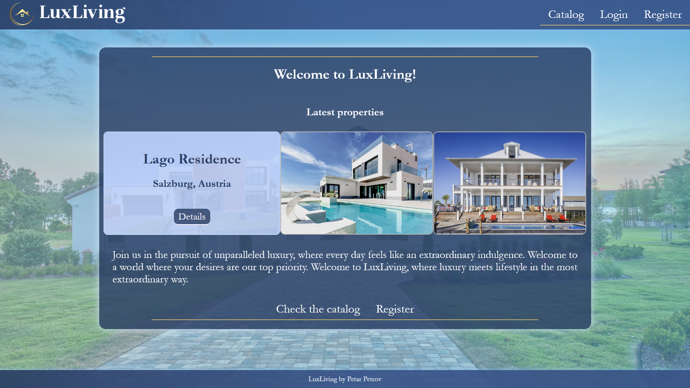

### Catalog page

The catalog section of the application serves as a comprehensive display of all real estate properties available on the platform. It provides users with powerful sorting, pagination, and search features for an enhanced browsing experience. Each property listing in the catalog includes a brief display of essential information. Clicking on the image opens a dedicated details page that presents the property.

#### Sort Functionality
Users can sort the properties based on various criteria to tailor their browsing experience:

- Time of Creation  
- Rating
- Alphabetically by Name
- By Price
- By Total Area

#### Search Functionality
The catalog includes search feature that enables users to find specific real estate properties efficiently by Name and Location. As users type, the search function dynamically responds to the input. The search result is shown after a brief pause, allowing users to refine their search queries without the need to click a search button.

#### Pagination
Pagination controls allow users to move between pages, making it convenient to explore properties beyond the initial display. Users can customize the number of properties displayed on a single page, providing flexibility based on their preferences and screen size.
<br>

Here's a comprehensive view of the catalog page: 
---

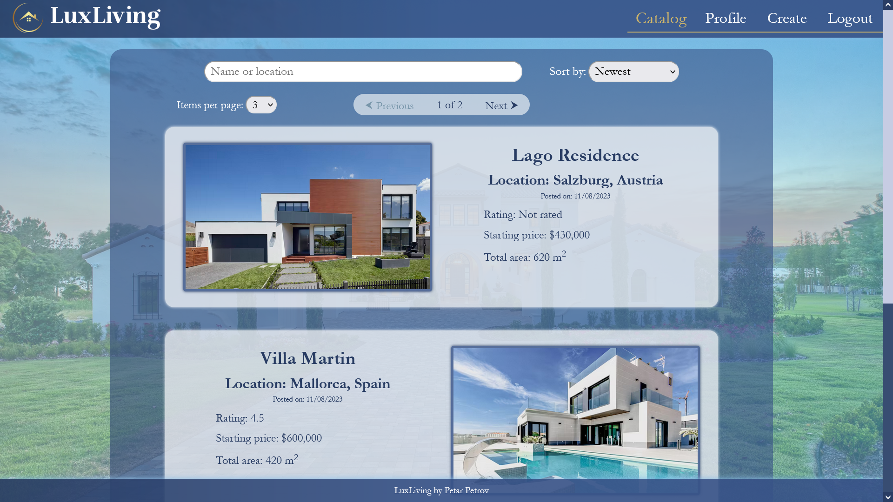


### Details page

The Details page provides a comprehensive view of a specific real estate property, offering users a wealth of information and interaction possibilities.

#### Property Information Section

The primary section of the Details page displays key information about the real estate property:

- The name of the property.
- The geographical location of the property.
- The rating assigned to the property based on user reviews. Including the number of reviews
- The timestamp indicating when the post for this property was created.
- The current listed price of the property.
- The total area of the property.
- If there are ongoing bids, this section displays the email of the current highest bidder.

To maintain fair and secure interactions, the Details page enforces specific restrictions based on user authentication and ownership:
If a user is not logged in, they are unable to place bids on the property. The same goes for the owner of the listed property, he is restricted from placing bids.

To submit a bid, the user needs to enter the desired bid price and then click on the "Bid" button.

A view of the Information Section:
---

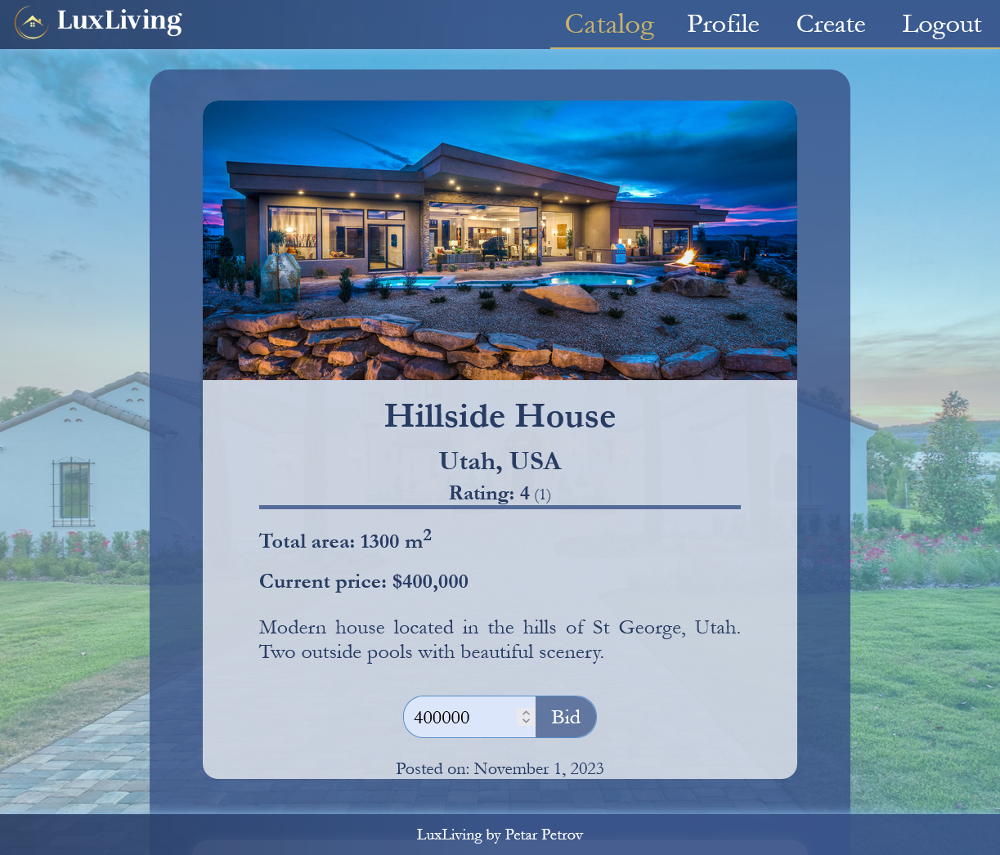
---

#### Reviews section

A secondary section on the Details page is dedicated to user reviews, with each review showing the following information:

- The email address of the user who created the review.
- The timestamp indicating when the review was created.
- The rating given by the user for the property.
- A short review providing insights into what the user liked or did not like about the property.

To write a review the user has to click on the "Add review" Button which opens a [modal](#review-modal).
- If the user is a guest, the "Add Review" button is not visible. This also applies to the owner of the Property.
- If the user has already written a review for the current property, the "Add Review" button is replaced with "Edit Review," allowing the user to edit their existing review.

A view of the Reviews Section:
---

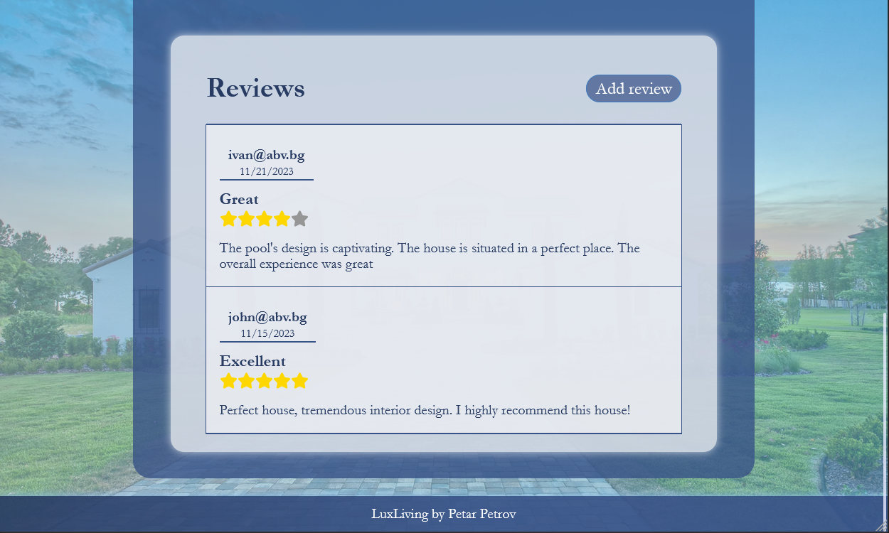
---
#### Review modal
When a user clicks on the "Add Review" or "Edit Review" button, a modal window appears, providing an intuitive interface for users to rate and review the real estate property. The modal consists of the following elements:

- <b>Star Rating Input</b> - A star-like input allows users to choose a rating from 1 to 5 stars. Initially, all stars appear grey. When a user clicks on a specific star, the selected star and all preceding stars light up in a yellow-gold color, indicating the chosen rating. Hovering over a star also produces the same yellow-gold color effect, providing visual feedback to users before making a selection.
- <b>Text Input: </b> - A text area where users can write a review about the property.
- <b>Submit (Edit) button</b> - A button to Submit or Update the review.
- <b>Close "X" button</b> - A button to cancel or close the modal without submitting the review.
- <b>Delete</b> - This button is available only if the user is editing his review.

A view of the modal:
---

| When adding a new Review                                 | When editing a review                                      |
| -------------------------------------------------------- | ---------------------------------------------------------- |
|  | 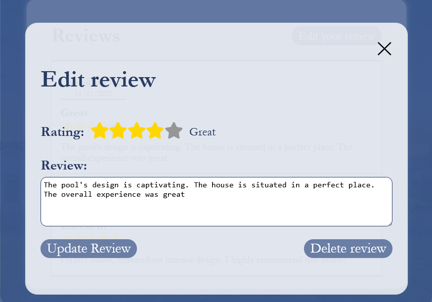 |
---

### Create page

The Create Page is accessible exclusively for logged-in users, providing a streamlined process for users to create and post details about a real estate property. Upon accessing the Create Page, users are presented with a user-friendly form to input information about the property they intend to list.
The form on the Create Page consists of the following input fields:
- Name - A text input where users can specify the name of the real estate property.

- Location - A text input allowing users to input the geographical location of the property.

- Image - An input field that allows users to upload an image representing the property.

- Price - A numerical input field where users can enter the current listed price of the property.

- Area - A numerical input field for users to input the total area of the property.

- Description - A text area where users can provide a detailed description of the property, including features, amenities, and any additional information they wish to share.

After filling out the form with the necessary details, users can proceed by clicking the "Submit" button which processes the form, creating a new post.

A view of the Create Page:
---

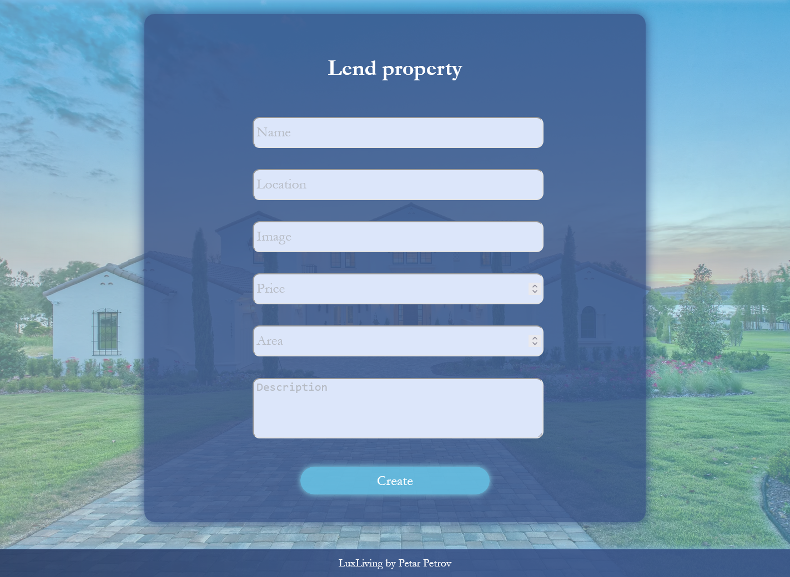
---


### Edit page
The edit page can be accessed by the owner of the post. Upon accessing the edit page, users are presented with the same form in the [Create Page](#create-page), but all inputs are filled with the property data they intend to edit. There is a condition that should be noted: If a bid has been placed on the current post, the price can't be edited and input is disabled. 
After the changes have been made in the input, users proceed with the sumbition by clicking the "Submit" button.

A view of the Edit Page:
---

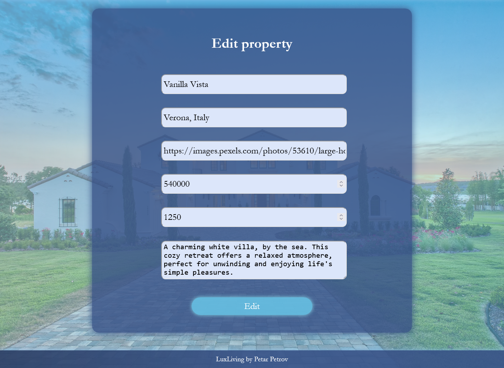
---

### Profile page
The personalized profile page designed to give the users a comprehensive overview of their activity on the platform. Here, users can find information about their posts, placed bids, and reviews. Upon landing on the page, users are presented with a section containing a dropdown menu and their posts (by default). The filtration of the results is simply done by clicking on the dropdown and selecting some of the options (posts, bids and reviews).

#### Own posts
When "posts" is selected, the user is presented with a page displaying their own posts in the form of images. When hovering over an image, comprehensive information about the corresponding post, along with additional buttons, is visualized. The user can use these buttons to do the following actions: 

- Details - Access the details page of the post
- Edit - Edit the post
- Delete - Completely delete the post

A view of the Profile page (posts):
---

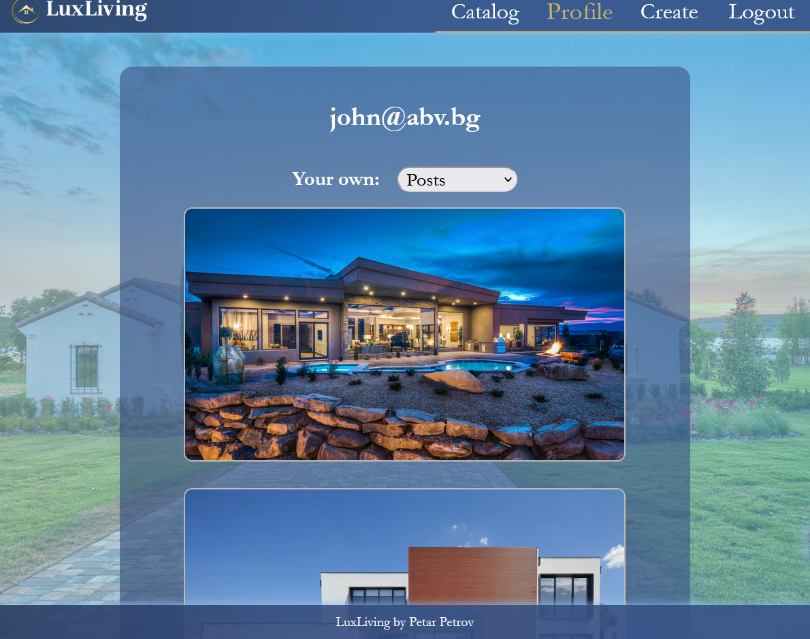
---


#### User bids
When the "bids" option is chosen, the page displays posts on which the user has placed a bid in a form similar to [own posts](#own-posts). They only difference is that the "Edit" and "Delete" buttons are not available, as the user is not the owner of the post.

A view of the Profile page (bids):
---

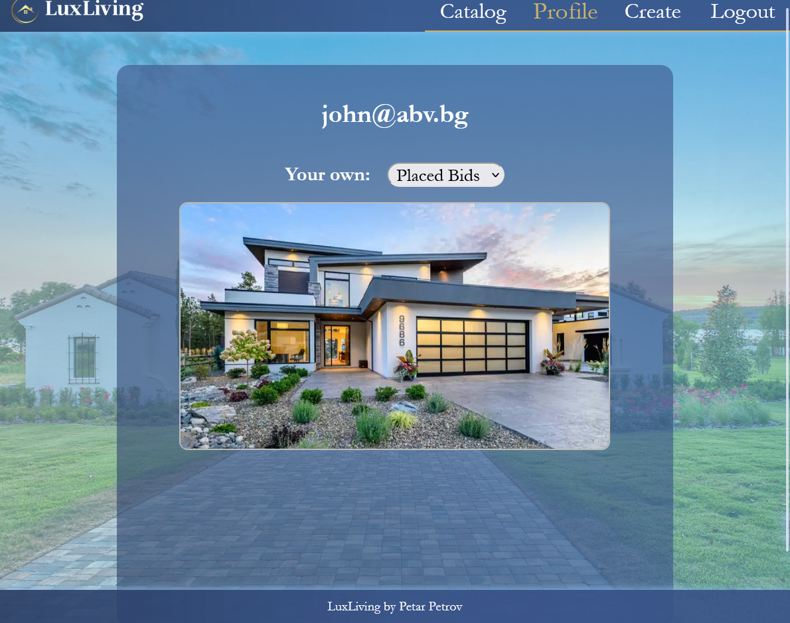
---


#### User reviews
When the "reviews" option is chosen on the profile page, the page showcases all reviews given by the user, along with the respective posts to which the reviews apply. Hovering over the image reveals a button that redirects to the post page.

A view of the Profile page (reviews):
---

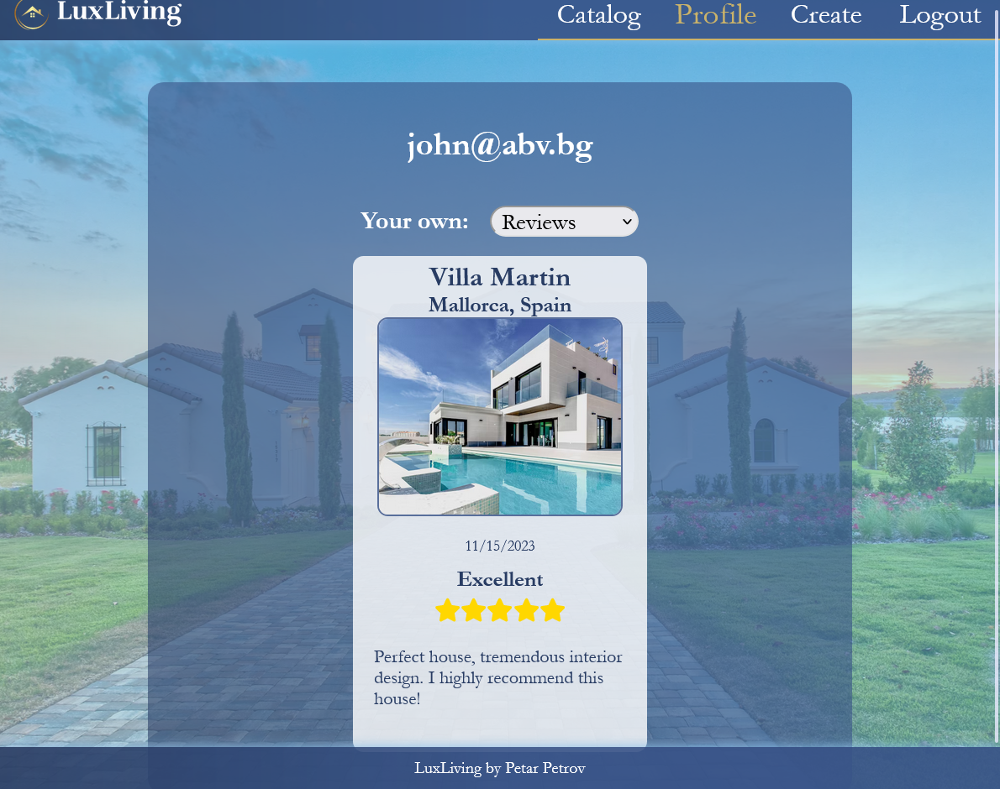
---

## Authentication

To ensure the security and privacy of the data, the app uses authentication to control access to certain functionalities. The authentication flow involves two main processes: login and registration. To gain access to these functionalities users need to navigate to the the [Register](#register-page) or [Login](#login-page) pages.

### Register page
Upon landing on the register page a form with inputs is presented. If the client doesn't currently have an account and wishes to access additional functionalities, they must fill these inputs by providing their email, creating a password and repeating the typed password. To submit the data the user has to click on the button.

A view of the Register page:
---

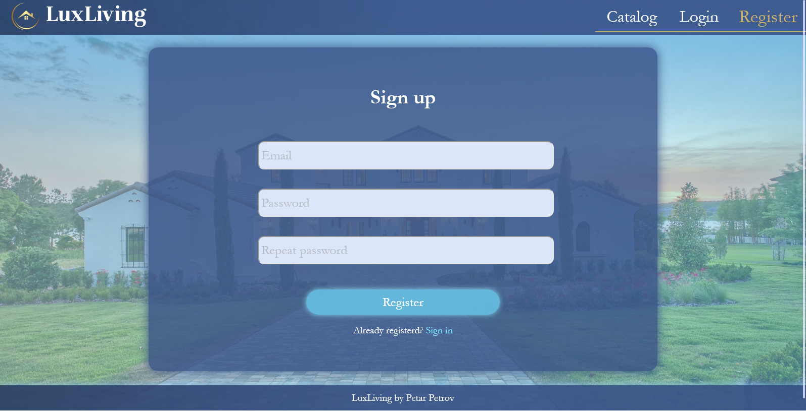
---
 
### Login page
Upon arriving on this page, a form featuring two input fields is displayed. One for the email and one for the password. To login the users must fill the inputs with the right email and password and submit the form.

A view of the Login page:
---

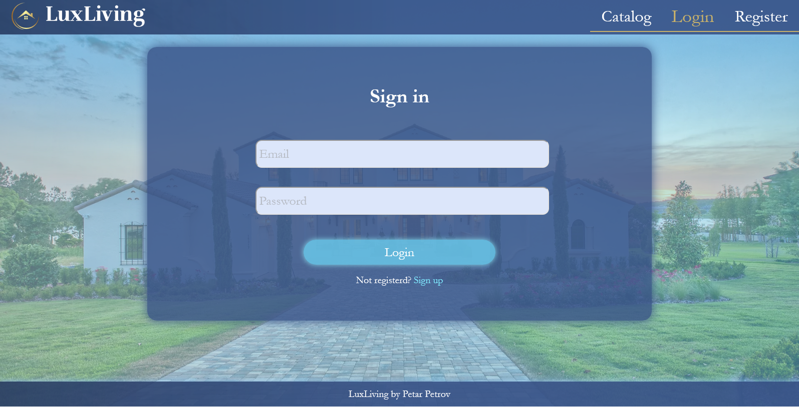
---

### Routes

Both authenticated users and guests can access the following pages:
- Home page
- Catalog page
- Detailed property page

The following pages can be only accessed by guests:
- Login
- Register
  
If the user has logged in he has access the following aditional pages:
- Create
- Profile
  
 


